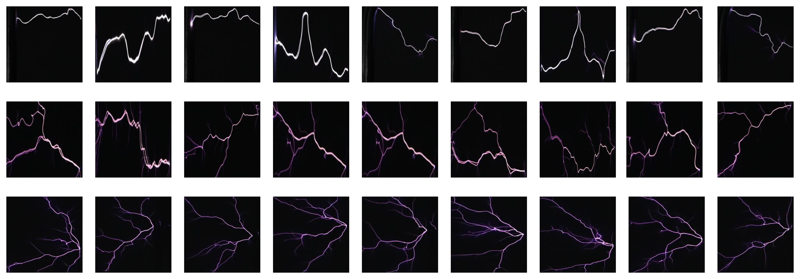

# PG-ArcSet: Arc Image Dataset for Power Grid Fault Detection

[](https://creativecommons.org/licenses/by/4.0/)
[](https://pytorch.org/)
                               

**Official repository for the paper: "Arc Image Dataset for Power Grid Fault Detection (PG-ArcSet)"**

## 📖 Introduction

**PG-ArcSet** is a standardized, high-voltage arc image dataset designed to facilitate deep learning research in power system fault diagnosis. The dataset captures the dynamic morphological characteristics of arcs under controlled laboratory conditions, addressing the lack of well-annotated public datasets in this field.

The dataset includes **1,950 images** preprocessed to 224×224 pixels, covering three fundamental arc types:
1.  **Line-type Arc:** High-current plasma channel, typical in short-circuit faults.
2.  **Branch-type Arc:** Main branch with divergence, typical in corona discharge.
3.  **Net-type Arc:** Mesh diffusion, typical in wet pollution on insulators.

<!-- [PLACEHOLDER] Upload 'Fig 3. Sample arcs data' from your paper here and name it assets/samples.png -->

*Figure: Samples of Line-type, Branch-type, and Net-type arcs.*

## 📂 Dataset Structure

The dataset is organized into three subfolders corresponding to the arc types. Each image has been centered and resized to 224×224 pixels.

```text
PG-ArcSet/
├── data.zip/ 
│   ├── line/      # Images of Line-type arcs
│   ├── branch/    # Images of Branch-type arcs
│   └── net/       # Images of Net-type arcs
```

## 🧪 Validation and Quality Assurance

To validate the suitability of the **PG-ArcSet** for deep learning applications, we conducted baseline experiments using two representative Convolutional Neural Networks (CNNs):
1.  **VGG16**: Representing performance-oriented, heavy architectures.
2.  **ShuffleNetV2**: Representing efficiency-oriented, lightweight architectures for edge deployment.

### ⚙️ Experimental Setup

The experiments were conducted under a controlled environment to ensure reproducibility.

*   **Hardware:** NVIDIA RTX A6000 GPU
*   **Software:** Python 3.7.16, PyTorch 1.13.1
*   **Data Split:** 80% Training, 20% Validation
*   **Hyperparameters:**
    *   **Epochs:** 10
    *   **Batch Size:** 32
    *   **Learning Rate:** 1e-5
    *   **Optimizer:** Adam

### 📊 Benchmark Results

The table below presents the performance metrics on the test set. The high precision and recall scores across both models demonstrate the dataset's high quality and the distinct visual features of the three arc types.

<table>
    <thead>
        <tr>
            <th>Model</th>
            <th>Arc Type</th>
            <th>Accuracy (Overall)</th>
            <th>Precision</th>
            <th>Recall</th>
            <th>F1-Score</th>
        </tr>
    </thead>
    <tbody>
        <!-- VGG16 Block -->
        <tr>
            <td rowspan="3" style="text-align:center; vertical-align:middle;"><strong>VGG16</strong></td>
            <td>Line-type</td>
            <td rowspan="3" style="text-align:center; vertical-align:middle;"><strong>97.83%</strong></td>
            <td>98.54%</td>
            <td>96.67%</td>
            <td>97.60%</td>
        </tr>
        <tr>
            <td>Branch-type</td>
            <td>97.38%</td>
            <td>96.88%</td>
            <td>97.13%</td>
        </tr>
        <tr>
            <td>Net-type</td>
            <td>97.54%</td>
            <td>98.93%</td>
            <td>98.75%</td>
        </tr>
        <!-- ShuffleNetV2 Block -->
        <tr>
            <td rowspan="3" style="text-align:center; vertical-align:middle;"><strong>ShuffleNetV2</strong></td>
            <td>Line-type</td>
            <td rowspan="3" style="text-align:center; vertical-align:middle;"><strong>96.00%</strong></td>
            <td>90.86%</td>
            <td>97.81%</td>
            <td>94.21%</td>
        </tr>
        <tr>
            <td>Branch-type</td>
            <td>99.52%</td>
            <td>99.52%</td>
            <td>99.52%</td>
        </tr>
        <tr>
            <td>Net-type</td>
            <td>97.42%</td>
            <td>90.87%</td>
            <td>94.03%</td>
        </tr>
    </tbody>
</table>
